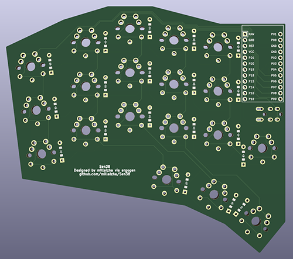

# Sen38
  

The Sen36 is 38-key split column stagger keyboard with pinky splay. 
Made using [ergogen](https://ergogen.xyz)

This keyboard is MX and Choc compatible.

## Notes

* .yaml does not include edge cuts. May need to add it in KiCAD.
* Changed some placements of the diodes in KiCAD.
* Will try to make the connections look better soon.
* Firmware to be added soon in my [QMK fork](https://github.com/millaizha/qmk_firmware).

